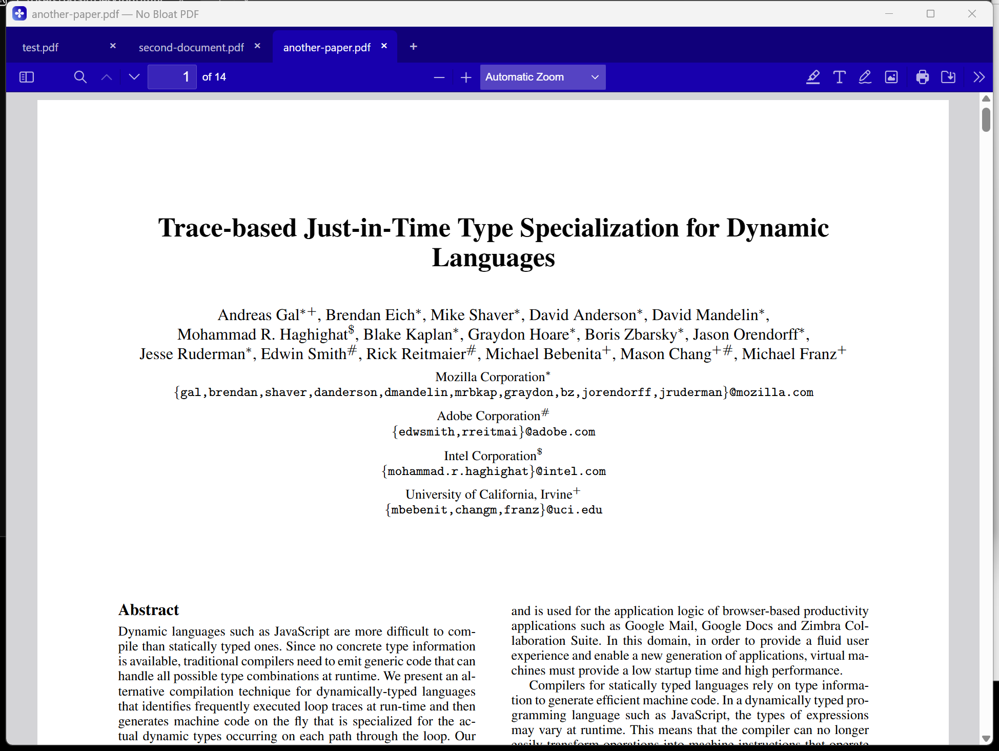

# No Bloat PDF

A free PDF viewer for Windows that just opens. 4.6 MB installer, instant
launch, tabs, full text search, dark mode, annotations, form filling, and
signatures. Zero network calls: no telemetry, no ads, no accounts, no cloud.

**Website & download:** https://www.nobloatpdf.com



## Why

The most common file on your computer somehow ended up behind slow launchers,
ads, cloud upsells, and sign-in prompts. This is the viewer I wanted instead:
small, instant, quiet, and free forever. The longer version is on the
[blog](https://www.nobloatpdf.com/blog/).

## What it does

- Opens PDFs instantly, including large, scanned, CJK, and password-protected files
- Tabs for multiple documents in one window (Ctrl+Tab / Ctrl+W)
- Full text search, thumbnails, bookmarks, outline, zoom, rotate
- Highlighting, text notes, freehand drawing, stamps, and signatures
- Fills standard PDF forms and saves locally
- High-resolution printing, dark mode, remembers your place in every file
- Makes zero network calls. Works identically with the internet unplugged

What it deliberately does not do: heavy PDF editing. Staying a viewer is how
it stays 4.6 MB and instant.

## How it's built

- [Mozilla pdf.js](https://mozilla.github.io/pdf.js/): the prebuilt viewer
  (the same renderer inside Firefox), vendored under `src/`
- [Tauri v2](https://tauri.app): a small native shell instead of a bundled
  browser, in `src-tauri/`
- The only custom frontend glue is `src/web/nobloat.js` (tabs, file opening,
  drag and drop, branding) plus the About window in `src/about.html`
- The website lives in `website/` and is plain HTML/CSS with SSI partials

## Building from source

Prerequisites: [Node.js](https://nodejs.org) 22+, [Rust](https://rustup.rs)
stable, and the [Tauri v2 system prerequisites](https://v2.tauri.app/start/prerequisites/)
for your platform.

```
npm install
npm run tauri dev     # run in development
npm run tauri build   # produce the installer
```

Release builds are configured to code-sign on the maintainer's machine
(`src-tauri/signing/`, Microsoft Artifact Signing) and will fall back with an
error if that setup is absent; remove or adjust `bundle.windows.signCommand`
in `src-tauri/tauri.conf.json` to build unsigned locally. macOS builds run
through `.github/workflows/macos-build.yml` with Developer ID signing and
notarization via repository secrets.

## License

No Bloat PDF is [MIT licensed](LICENSE).

Bundled third-party components: [pdf.js](src/LICENSE.pdfjs.txt) is Apache
License 2.0 (c) Mozilla; the app shell is built with Tauri (MIT / Apache 2.0).
Adobe and Acrobat are trademarks of Adobe Inc., referenced only for comparison.

## Support

The project is free forever, with no monetization beyond an optional
[Buy Me a Coffee](https://buymeacoffee.com/briangalvan).

Built by [Brian Galvan](https://www.nobloatpdf.com/#story).
